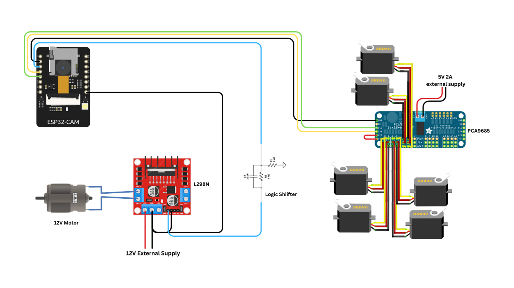
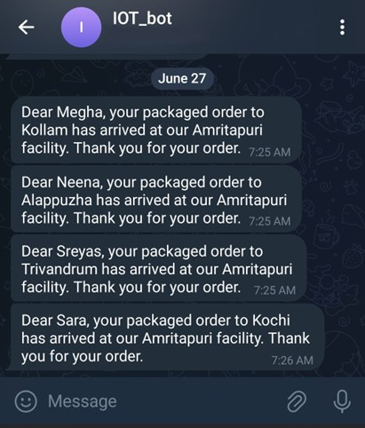

# Smart Parcel Sorting Conveyor System using QR Identification & IoT Notification

An IoT-enabled smart logistics system designed to automate parcel sorting using QR code-based identification and real-time cloud notifications.

---

## 📌 Overview

This project presents a smart conveyor-based parcel sorting system using the ESP32-CAM module for QR code recognition and servo-controlled gates for automated parcel routing.

The system scans QR codes attached to parcels, extracts customer details and destination information, and dynamically sorts them into designated bins using a servo-actuated conveyor mechanism.

---

## ⚙️ Key Features

- QR Code-Based Parcel Identification
- Automated Servo-Controlled Gate Sorting
- Conveyor Belt Motor Control
- Telegram-Based Customer Notification
- Google Sheets Logging for Parcel Tracking
- Remote Monitoring via Arduino IoT Cloud

---

## 🛠️ Hardware Components Used

- ESP32-CAM Module  
- PCA9685 PWM Servo Driver  
- MG90S Servo Motors (6 units)  
- L298N Motor Driver  
- 12V DC Motor  
- Logic Level Converter  
- Conveyor Belt Assembly  

---

## 🔌 Circuit Diagram

---

## 🧪 Hardware Implementation

---

## 📩 Telegram Notification System

---

## 📄 Project Report
Full documentation available here:  
[Smart_Parcel_Sorting_Report.pdf](smart_parcel_sorting.pdf)

---

## 📈 Applications
- Logistics and Courier Centers  
- E-Commerce Warehouses  
- Smart Post Offices  
- Airport Baggage Handling Systems  
- Automated Warehouse Management
